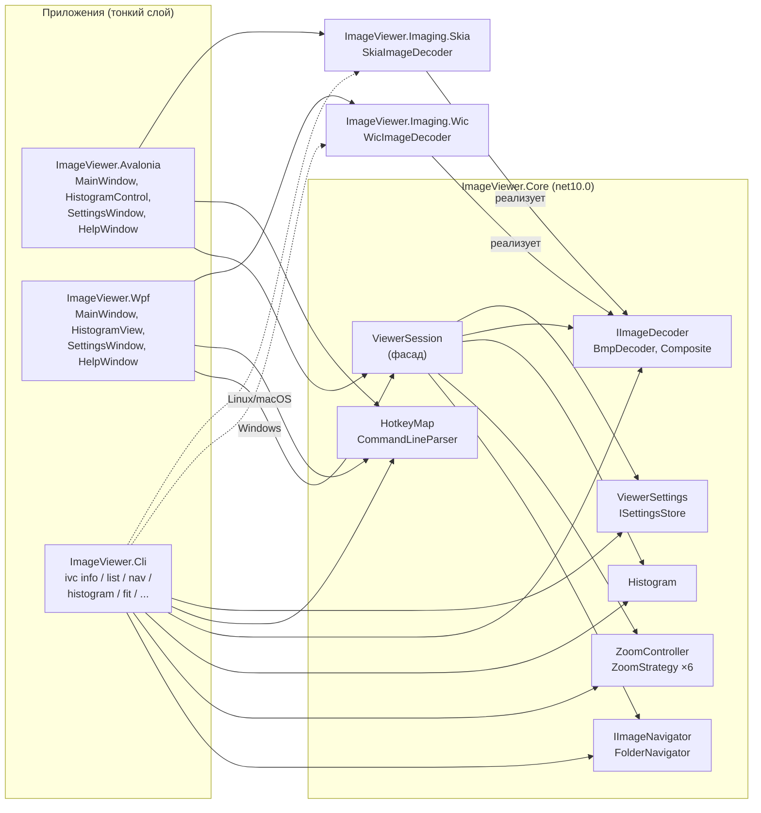

ВЯТКИНА ЕКАТЕРИНА 231-321
# Image Viewer — инструмент полноэкранного просмотра изображений

Курсовой проект на **C# 14 / .NET 10**. Полноэкранный просмотрщик изображений с переиспользуемой
библиотекой логики и **двумя графическими интерфейсами** к ней:

* **Avalonia** (`ImageViewerX`) — работает в Linux (Fedora, Ubuntu…), Windows и macOS;
* **WPF** (`ImageViewer.exe`) — только Windows.

Плюс консольная утилита `ivc`, модульные тесты и демонстрация в Jupyter Notebook.
Оба интерфейса используют одну и ту же библиотеку `ImageViewer.Core` — вся логика общая, окна отличаются только «склейкой».

## Возможности

| Функция | Как пользоваться |
|---|---|
| Открытие файла из командной строки | `ImageViewer.exe photo.jpg` или папки `ImageViewer.exe C:\Photos` |
| Выбор другого файла | `Ctrl+O`, перетаскивание файла в окно |
| Зумирование | колесо мыши (относительно курсора), `+` / `−` |
| Перемещение | перетаскивание левой кнопкой, `W A S D`, `↑ ↓`, `Ctrl+← →` |
| Режимы масштаба | `1` — 100%, `2` — вписать в экран, `3` — уменьшить до экрана, `4` — по ширине, `5` — по высоте, `6` — заполнить |
| Поворот | `R` / `Shift+R` |
| Навигация по папке | `→` `←` `Space` `Backspace` `PageUp/PageDown`, `Home` / `End`, `Shift+→/←` — через 10, кнопки мыши «Назад/Вперёд» |
| Номер изображения и количество | строка состояния: `3 / 27` |
| Сведения о файле | `I` — панель: размер, тип, MIME, разрешение, мегапиксели, пропорции, глубина цвета, даты |
| Гистограмма | `H` — каналы R, G, B и яркость, линейная/логарифмическая шкала, тени/света |
| Цвет пикселя под курсором | строка состояния: `x: 120  y: 45  #A0B0C0` |
| Слайд-шоу | `Ctrl+S` / `F6` |
| Темы и фон | `T` — тёмная/светлая, `B` — фон: цвет темы / свой цвет / шахматка |
| Сглаживание | `P` — сглаживание или «пиксели» (для пиксель-арта) |
| Полный экран | `F11`, `F`, `Enter`, двойной щелчок; `Esc` — выход из полноэкранного режима |
| Настройки | `F9` — сохраняются в `%AppData%\ImageViewer\settings.json` |
| Справка | **`F1`** — горячие клавиши и параметры командной строки |

Форматы: в Avalonia-версии (SkiaSharp) — JPEG, PNG, GIF, BMP, WebP, ICO на любой ОС;
в WPF-версии (WIC) — ещё TIFF, JPEG XR, а также HEIC при установленных в Windows кодеках.
Учитывается EXIF-ориентация фотографий. Соседние изображения предзагружаются в фоне — листание мгновенное.

## Структура решения

```
ImageViewer.slnx / ImageViewer.sln / ImageViewer.Linux.slnf
├── src/
│   ├── ImageViewer.Core/          ← библиотека классов (net10.0, без зависимостей от UI)
│   │   ├── Imaging/               форматы, чтение заголовков, IImageDecoder, BMP-кодек, гистограмма
│   │   ├── Files/                 ImageFileInfo, ImageInfoReader, форматирование размера
│   │   ├── Navigation/            IImageNavigator, FolderNavigator, естественная сортировка
│   │   ├── Viewing/               ZoomController, стратегии масштаба, геометрия, матрица
│   │   ├── Settings/              ViewerSettings, ISettingsStore, JsonSettingsStore
│   │   ├── Commands/              ViewerCommand, CommandCatalog, HotkeyMap
│   │   ├── CommandLine/           CommandLineParser, CommandLineOptions, HelpText
│   │   └── Session/               ViewerSession (фасад), SlideshowController, LruCache<TKey,TValue>
│   ├── ImageViewer.Imaging.Skia/  ← кроссплатформенный декодер SkiaSharp (net10.0)
│   ├── ImageViewer.Imaging.Wic/   ← адаптер Windows: декодер WIC (net10.0-windows)
│   ├── ImageViewer.Avalonia/      ← графическое приложение ImageViewerX (Linux/Windows/macOS)
│   ├── ImageViewer.Wpf/           ← графическое приложение ImageViewer.exe (Windows)
│   └── ImageViewer.Cli/           ← консольная утилита ivc
├── tests/ImageViewer.Core.Tests/  ← xUnit-тесты библиотеки (140 тест-кейсов)
├── demo/demo.ipynb                ← демонстрация в Jupyter
└── docs/TESTING.md                ← сценарии ручной проверки
```

## Архитектура



**Главная идея:** окно ничего не вычисляет. Оно переводит клавиши и мышь в команды (`ViewerCommand`),
передаёт их в `ViewerSession` и рисует результат. Масштаб, положение и поворот считает `ZoomController`
в пикселях и отдаёт **матрицу 3×2** (`Matrix2D`), которую WPF применяет как `MatrixTransform`
(в Avalonia — тот же `MatrixTransform` из `Avalonia.Media`, в WinForms — `Graphics.Transform`).

### Использование ООП и средств C#

| Средство | Где используется |
|---|---|
| **Классы, свойства** | `ImageFileInfo`, `ViewerSettings`, `ZoomController`, `FolderNavigator`… |
| **Интерфейсы** | `IImageDecoder` (3 реализации: BMP, WIC, Skia), `IImageNavigator`, `ISettingsStore`, `ICliCommand` |
| **Наследование и полиморфизм** | `ZoomStrategy` → 6 стратегий (`ShrinkToFitStrategy : FitToScreenStrategy` вызывает `base`); `ImageDecoderBase` → `BmpDecoder`, `WicImageDecoder`, `SkiaImageDecoder`; `CliCommandBase` → 9 команд; `HistogramView : FrameworkElement` (WPF), `HistogramControl : Control` (Avalonia) |
| **Абстрактные классы** | `ZoomStrategy`, `ImageDecoderBase`, `CliCommandBase` |
| **События** | `ZoomController.Changed`, `IImageNavigator.CurrentChanged`, `ViewerSession.ImageLoaded/ImageLoadFailed/HistogramReady`, `SlideshowController.StateChanged` |
| **Собственные EventArgs** | `NavigationChangedEventArgs`, `ImageLoadedEventArgs`, `ImageLoadFailedEventArgs` (первичные конструкторы) |
| **Коллекции** | `List<T>`, `Dictionary<K,V>`, `HashSet<T>`, `LinkedList<T>`, `IReadOnlyList<T>`, `IReadOnlySet<T>` |
| **Обобщения (generics)** | `LruCache<TKey, TValue>` с ограничением `where TKey : notnull` |
| **Записи (record)** | `ImageFileInfo` (+ `with`), `ImageHeader`, `SizeD`, `PointD`, `Matrix2D`, `PixelColor`, `CommandInfo` |
| **Перечисления** | `ZoomMode`, `Rotation`, `ViewerCommand`, `AppTheme`, `BackgroundMode`, `SortMode`… |
| **Сопоставление с образцом** | разбор форматов, `switch`-выражения, шаблоны свойств и списков |
| **async/await, отмена** | `ViewerSession.LoadCurrentAsync` (Task.Run + CancellationToken), `PeriodicTimer` в слайд-шоу |
| **Паттерны** | Фасад (`ViewerSession`), Стратегия (`ZoomStrategy`), Компоновщик (`CompositeImageDecoder`), Адаптер (`WicImageDecoder`, `SkiaImageDecoder`), Команда (`ViewerCommand` + `HotkeyMap`) |
| **LINQ** | сортировка файлов, справка, CLI |
| **Span / BinaryPrimitives** | чтение заголовков PNG/JPEG/GIF/BMP/TIFF/WebP без внешних библиотек |
| **Сериализация** | `System.Text.Json` с `JsonStringEnumConverter` |

## Сборка и запуск

Требуется **.NET SDK 10** и **Visual Studio 2026** (рабочая нагрузка «Разработка классических приложений .NET»)
или VS Code с C# Dev Kit.

```powershell
# Сборка всего решения (Windows)
dotnet build ImageViewer.slnx -c Release

# Тесты
dotnet test tests/ImageViewer.Core.Tests

# Графическое приложение
dotnet run --project src/ImageViewer.Wpf -- C:\Photos\photo.jpg --zoom fit
# или напрямую
src\ImageViewer.Wpf\bin\Release\net10.0-windows\ImageViewer.exe photo.jpg

# Консольная утилита
dotnet run --project src/ImageViewer.Cli -- help
```

В Visual Studio: открыть `ImageViewer.slnx`, сделать `ImageViewer.Wpf` запускаемым проектом.
Параметры запуска для отладки — «Свойства проекта → Отладка → Аргументы командной строки».

### Linux (Fedora и др.) — Avalonia-версия

```bash
sudo dnf install dotnet-sdk-10.0        # проверить: dotnet --list-sdks (нужна строка 10.0.x)
dotnet build ImageViewer.Linux.slnf     # библиотека, Avalonia, консоль, тесты
dotnet test  ImageViewer.Linux.slnf

dotnet run --project src/ImageViewer.Cli -- generate demo/images --count 12
dotnet run --project src/ImageViewer.Avalonia -- demo/images/demo_1.bmp --zoom fit --info
```

Готовый исполняемый файл после сборки: `src/ImageViewer.Avalonia/bin/Debug/net10.0/ImageViewerX`.
Параметры командной строки и горячие клавиши у обеих версий одинаковые (общий `CommandLineParser` и `HotkeyMap`).

### VS Code

Расширения: **C# Dev Kit**, **Jupyter**, **Python**. В папке `.vscode` уже есть конфигурации запуска:
«Avalonia (Linux/Windows/macOS)» и «WPF (только Windows)» — выберите на вкладке «Run and Debug» и нажмите F5.
Перед первым запуском создайте тестовые картинки: Ctrl+Shift+P → «Tasks: Run Task» → `generate-demo-images`.

### Файлы решения

`ImageViewer.slnx` — новый формат (нужен SDK ≥ 9.0.200), `ImageViewer.sln` — классический,
`ImageViewer.Linux.slnf` — фильтр без Windows-проектов. На Linux WPF-проекты компилируются
(`EnableWindowsTargeting`), но запускаются только в Windows.

## Параметры командной строки (`ImageViewerX` и `ImageViewer.exe`)

```
ImageViewer [путь] [параметры]

  путь                       Файл изображения или папка с изображениями
  -z, --zoom <режим>         100 | fit | shrink | width | height | fill
  -f, --fullscreen           Полноэкранный режим
  -m, --maximized            Развёрнутое окно
  -w, --windowed             Обычное окно
  -t, --theme <dark|light>   Тема оформления
  -b, --background <фон>     theme | checker | #RRGGBB
  -s, --slideshow [сек]      Запустить слайд-шоу (интервал в секундах)
      --sort <порядок>       name | date | size | type
      --desc, --asc          Порядок сортировки
      --wrap, --no-wrap      Переход по кругу в папке
  -i, --info                 Показать панель информации о файле
      --histogram            Показать гистограмму (--no-histogram — скрыть)
      --pixelated, --smooth  Масштабирование без сглаживания / со сглаживанием
  -n, --index <N>            Открыть N-е изображение папки (с 1)
      --settings <файл>      Использовать другой файл настроек
      --reset-settings       Сбросить настройки по умолчанию
  -h, -?, --help             Справка
```

Примеры:

```powershell
ImageViewer photo.jpg --zoom 100 --info
ImageViewer C:\Photos --sort date --desc --slideshow 5
ImageViewer sprite.png -z fill --pixelated -b checker --windowed
```

Параметры командной строки действуют только на текущий запуск и не изменяют сохранённые настройки.

## Консольная утилита `ivc`

| Команда | Назначение |
|---|---|
| `ivc info <файл> [--json]` | сведения о файле |
| `ivc list <папка\|файл> [--sort ...] [--desc] [--json]` | список изображений папки с номерами |
| `ivc nav <файл> [--step N] [--no-wrap] [--first\|--last]` | результат навигации по папке |
| `ivc histogram <файл> [--channel lum\|r\|g\|b\|all] [--json]` | гистограмма псевдографикой или JSON |
| `ivc fit <файл\|ШxВ> [--viewport 1920x1080] [--zoom ...] [--rotate 90]` | расчёт масштаба для всех режимов |
| `ivc generate <папка> [--count 8] [--size 800x600]` | тестовые изображения |
| `ivc check-args -- <параметры GUI>` | как `ImageViewer.exe` поймёт командную строку |
| `ivc keys` | горячие клавиши |
| `ivc settings` | текущие пользовательские настройки |

Пример:

```
> ivc fit 4000x3000 --viewport 1920x1080
Изображение 4000×3000, экран 1920×1080, поворот 0°

  Режим                    Масштаб     На экране       Смещение  Прокрутка
  100%                        100%     4000×3000   (-1040; -960)  да
  Вписать в экран             36%      1440×1080       (240; 0)  нет
  Уменьшить до экрана         36%      1440×1080       (240; 0)  нет
  По ширине                   48%      1920×1440        (0; 0)   да
  По высоте                   36%      1440×1080       (240; 0)  нет
  Заполнить экран             48%      1920×1440      (0; -180)  да
```

## Как подключить библиотеку к другому UI

Так устроена Avalonia-версия (полный код — `src/ImageViewer.Avalonia/MainWindow.axaml.cs`);
для WinForms/MAUI — аналогично: декодер `IImageDecoder` + матрица из `ZoomController`.

```csharp
var session = new ViewerSession(new SkiaImageDecoder(), new JsonSettingsStore().Load());
image.RenderTransformOrigin = RelativePoint.TopLeft;              // матрица считается от левого верхнего угла
session.ImageLoaded += (_, e) => image.Source = BitmapConverter.ToBitmap(e.Image);   // RawImage → Bitmap
session.Zoom.Changed += (_, _) =>
{
    var m = session.Zoom.GetTransform();
    image.RenderTransform = new MatrixTransform(new Matrix(m.M11, m.M12, m.M21, m.M22, m.OffsetX, m.OffsetY));
};
viewport.SizeChanged += (_, e) => session.Zoom.SetViewport(new SizeD(e.NewSize.Width, e.NewSize.Height));
await session.OpenAsync(args[0]);
```

Горячие клавиши переводятся в строки жестов (`"Ctrl+O"`, `"Right"`, `"Plus"`) и разрешаются
через `HotkeyMap.Resolve` — сама таблица клавиш и справка общие для всех интерфейсов.

## Тестирование

* `tests/ImageViewer.Core.Tests` — модульные и интеграционные тесты: масштабирование и матрица преобразования,
  навигация и сортировка, разбор заголовков всех форматов, BMP-кодек, гистограмма, командная строка,
  горячие клавиши, настройки, LRU-кэш, сессия и слайд-шоу.
* `docs/TESTING.md` — чек-лист ручной проверки графического интерфейса для защиты.
* `demo/demo.ipynb` — демонстрация всех сценариев командной строки.
